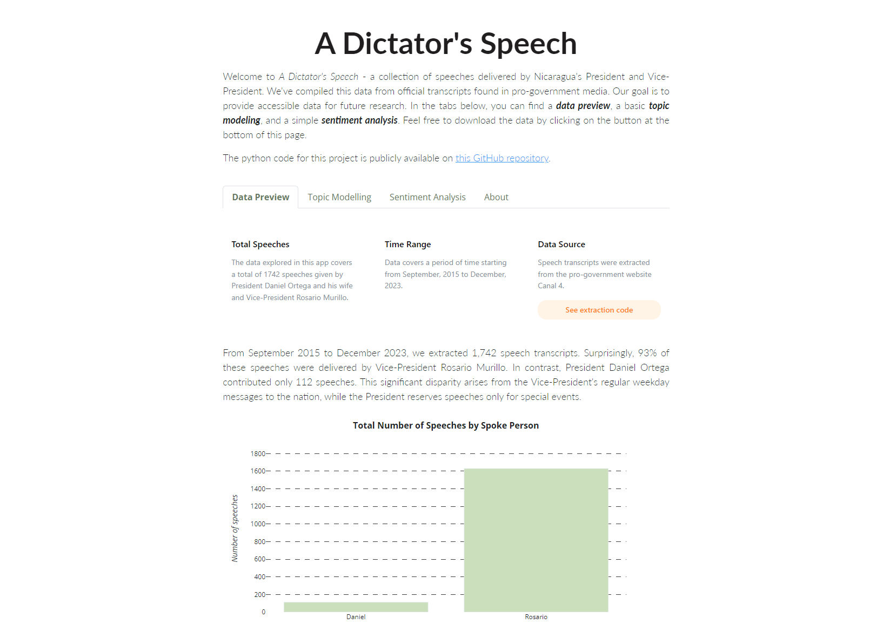

# Nicaragua-dictators-speech
**Nicaragua: A Dictator's Speech** is a data base of speeches delivered by Nicaragua's President and Vice-President. We've compiled this data from official transcripts found in pro-government media. Our goal is to provide accessible data for future research. The data project has a [website](https://nicaragua-dictators-speech.onrender.com/) that is regularly updated. There, you can find a _data preview_, a basic _topic modeling_, and a simple _sentiment analysis_. Feel free to download the data from this repository or from the website.

### Licence

Copyright (c) 2023

_Permission is hereby granted, free of charge, to any person obtaining a copy
of this software and associated documentation files (the "Software"), to deal
in the Software without restriction, including without limitation the rights
to use, copy, modify, merge, publish, distribute, sublicense, and/or sell
copies of the Software, and to permit persons to whom the Software is
furnished to do so, subject to the following conditions_:

_The above copyright notice and this permission notice shall be included in all
copies or substantial portions of the Software._

_THE SOFTWARE IS PROVIDED "AS IS", WITHOUT WARRANTY OF ANY KIND, EXPRESS OR
IMPLIED, INCLUDING BUT NOT LIMITED TO THE WARRANTIES OF MERCHANTABILITY,
FITNESS FOR A PARTICULAR PURPOSE AND NONINFRINGEMENT. IN NO EVENT SHALL THE
AUTHORS OR COPYRIGHT HOLDERS BE LIABLE FOR ANY CLAIM, DAMAGES OR OTHER
LIABILITY, WHETHER IN AN ACTION OF CONTRACT, TORT OR OTHERWISE, ARISING FROM,
OUT OF OR IN CONNECTION WITH THE SOFTWARE OR THE USE OR OTHER DEALINGS IN THE
SOFTWARE._

### Disclaimer

This application ("App") is provided for informational purposes only. The content 
within the App is not intended to be a substitute for professional advice. While 
efforts have been made to ensure the accuracy and reliability of the information 
provided, the creators make no representations or warranties of any kind, express 
or implied, about the completeness, accuracy, reliability, suitability, or 
availability with respect to the App or the information, products, services, or 
related graphics contained within the App for any purpose. 

The use of this App is at your own risk. The creators shall not be liable for 
any loss or damage arising from the use of this page.

Please note that the App may contain links to external websites or resources. 
The inclusion of any links does not necessarily imply a recommendation or 
endorsement of the views expressed within them.